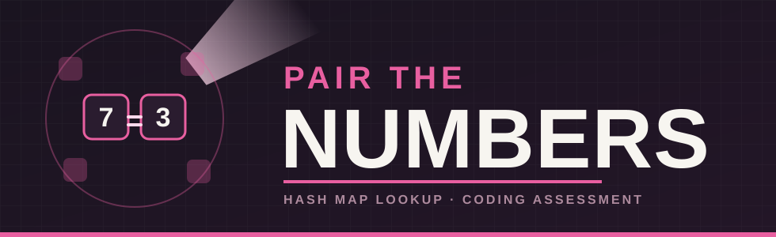

<p align="center">
  
</p>

# Pair the Numbers — starter project

Somebody just handed you a shoebox of raffle stubs, each printed with a
single number, and announced the prize total out loud. Somewhere in that
box are exactly two stubs whose numbers add up to that total — find
them, and you find the winner.

This repo is where you build that up, in Python or Java, whichever
you're happier in. Both are graded the same way, so pick on comfort, not
on which one you think looks better.

## The problem

You're given `numbers` — a list of integers, in a fixed order — and
`target`, the number they're looking for a pair to add up to.

**Your job:**

```
find_pair(numbers, target) -> (i, j)
```

Find two *different* positions `i` and `j` in the list such that
`numbers[i] + numbers[j] == target`. A stub can't be paired with itself
— `i` and `j` have to be different positions, even if the numbers
printed on them happen to be equal.

More than one valid pair might exist. When that happens, return the one
that *completes first* reading the list left to right: out of every
valid pair, take the one with the smallest second position, and if two
pairs tie on that, the one with the smallest first position. Return the
pair as `(i, j)` with `i < j`. If no valid pair exists at all, return
`(-1, -1)`.

### Worked example

```
numbers: 1, 4, 6, 9
target:  10
```

Scanning left to right, the first three numbers (`1`, `4`, `6`) don't pair
with anything seen so far. Then position 2 (`6`) pairs with position 1
(`4`): `4 + 6 = 10`. That's the first completed pair. It doesn't matter
that position 3 (`9`) also completes a pair with position 0 (`1 + 9 =
10`) — that one finishes *later* in the scan, at position 3, not
position 2, so it isn't the answer.

- Answer → `(1, 2)`

Want a slower, more thorough walk through this and one more example,
staged decision by decision? See [EXAMPLE.md](EXAMPLE.md).

### Constraints

Nothing sneaky here — just the numbers to design around:

- `2 ≤ number of integers ≤ 300,000`
- `-10^9 ≤ each number ≤ 10^9`
- `-2×10^9 ≤ target ≤ 2×10^9`

## Layout

```
pair-the-numbers-starter/
  test_data/
    simple/    <- 8 tiny, hand-traceable cases
    medium/    <- 5 bigger hand-designed cases, still traceable on paper
    hard/      <- 6 generated cases — too large to solve by hand
  python/
    pair_numbers.py    <- implement your solution here
    test_data.py          loads cases from ../test_data
    main.py                a small demo runner (prints one example)
    run_tests.py            the test harness — every case, PASS/FAIL, timing, an efficiency band
    scripts/
      compile.sh            syntax-checks the Python files
      run.sh                 runs main.py
      test.sh                runs run_tests.py
  java/
    src/
      PairNumbers.java    <- implement your solution here
      TestData.java          loads cases from ../test_data
      Main.java               a small demo runner (prints one example)
      TestRunner.java          the test harness — every case, PASS/FAIL, timing, an efficiency band
    scripts/
      compile.sh            javac's everything into java/build
      run.sh                 compiles, then runs Main
      test.sh                compiles, then runs TestRunner
```

You only need to touch `pair_numbers.py` / `PairNumbers.java` —
everything else is scaffolding that's already wired up and ready to go:
the test data, the demo runner, the test harness, the shell scripts.

Each solution file has one empty helper method already sketched in
(finding the earliest position holding a given value). Use it, rename
it, rip it out entirely — whatever gets you to a solution you're happy
with. It's there to save you some typing, not to tell you how to think
about the problem.

## Test data tiers

- **Simple** (`test_data/simple/`) — a handful of numbers, small enough
  to check your basic matching logic just by looking at it.
- **Medium** (`test_data/medium/`) — still small enough to trace on
  paper if you want to sanity-check an answer, but it takes real
  attention — a couple of cases are built specifically so that the
  obvious first approach lands on *a* valid pair that isn't *the*
  correct one.
- **Hard** (`test_data/hard/`) — nobody's tracing these by hand. Some are
  moderate in size but built so there's no shortcut around checking
  almost every possible pair before ruling one out; others are just
  large — realistic-scale lists, tens or hundreds of thousands of
  numbers, to check your solution's performance holds up once the input
  actually gets big. If a run hangs or drags on the `hard` tier, that's
  worth digging into — the input isn't broken, your approach probably
  needs a rethink.

## Quick start

Python (needs Python 3.8+, no other dependencies):

```bash
cd python
./scripts/test.sh     # run the test suite
./scripts/run.sh       # run the demo on one example case
```

Java (needs a JDK on your PATH, no build tool required):

```bash
cd java
./scripts/test.sh     # compiles, then runs the test suite
./scripts/run.sh       # compiles, then runs the demo on one example case
```

## Definition of done

`./scripts/test.sh` should print `TOTAL: 19 passed, 0 failed` in both
languages, ending with `Efficiency band: Efficient (< 2s total)`. Right
now every test fails with `NOT IMPLEMENTED` — that's your starting line,
not a bug.

That last line is reading the `hard` tier's total time: `Efficient` under
2 seconds, `Adequate` up to 10, `Slow` beyond that. A correct, reasonably
efficient solution should land comfortably in `Efficient`. If you're
seeing `Adequate` or `Slow`, or the hard tier just never finishes, take
that seriously — it's telling you something real about your approach, not
just filling space at the bottom of the output.

This one's meant to be a confidence builder — a clean pass here is a good
sign heading into the rest of the assessment. Good luck.
